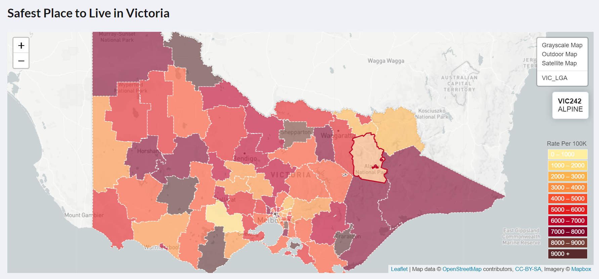
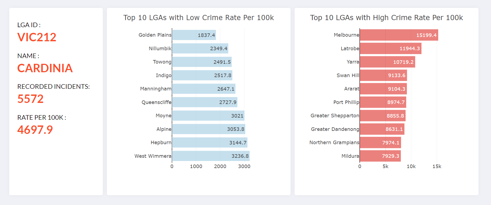
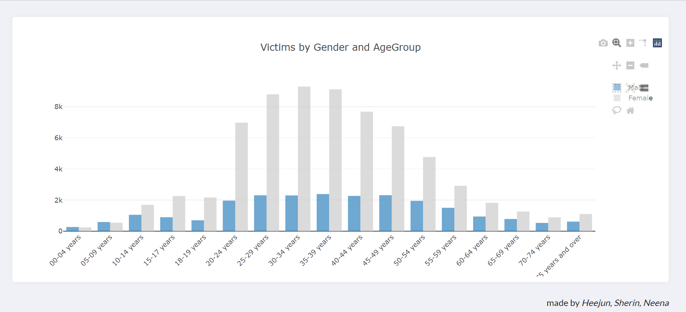

# Crime Data Visualisation
This project is aimed to look at available data for Crime Incidents across Victoria for the past five years from 2017 to 2021 to identify the safest LGAs (Local Government Areas) in Victoria. The following scenarios were specifically looked at: 
<ul>
<li>Geo Spatial mapping of crime rates across the 79 LGAs in Victoria</li>
<li>Top 10 LGAs in Victoria with lowest crime rates</li>
<li>Top 10 LGAs in Victoria with highest crime rates</li>
<li>What are the most common offence types under the crime incidents</li>
<li>How the crime rates by offence types have changed over the years from 2017 to 2021</li>
<li>Breakdown of the Family Crime Victims based on gender and age</li>
</ul>

There were two datasets used for this project from https://www.crimestatistics.vic.gov.au/crime-statistics/latest-victorian-crime-data/download-data
<i>Data_Tables_LGA_Criminal_Incidents_Year_Ending_March_2021</i>
This file contains the crime incidents recorded and the crime rate per 100,000 population for each of the 79 LGAs for the time period 2012 - 2021. It also contains the crimes categorised by offence types. 
<i>Data_Tables_Family_Incidents_Visualisation_Year_Ending_March_2021</i>
This file contains the Family Crimes Victim data categorized by Gender and Age for the period 2017 - 2021
CSV file. 
Additonal GEO JSON LGA polygon data from https://data.gov.au/dataset/ds-dga-bdf92691-c6fe-42b9-a0e2-a4cd716fa811/details?q=
  
Jupyter notebook and Python Pandas were used to read, clean and manipulate data to find answer for our queries. It was loaded to MongoDB using PyMongo and the API endpoints were provided using Python Flask. The data visualization was done using JavaScript, HTML, Plotly, and Leaflet. 
The viewer can select a year from the dropdown and see the visualization for the respective year. The visualizations looks as following: 

We reached to the following conculsion after the analysis.
<ul>
<li>LGAs with most crime rates in Victoria are Melbourne, LaTrobe, Yarra</li>
<li>LGAs with least crime rates in Victoria are Golden Plains, Nilumbik, Towong</li>
<li>Most common crime offence type in the past five years is Property and deception offences. This has seen a decrease from 2017 to 2021. The offences listed as others has gone up in 2021.</li>
<li>75 % of the family violence victims are females and majority are in the age bracket of 30-35.</li>
</ul>

